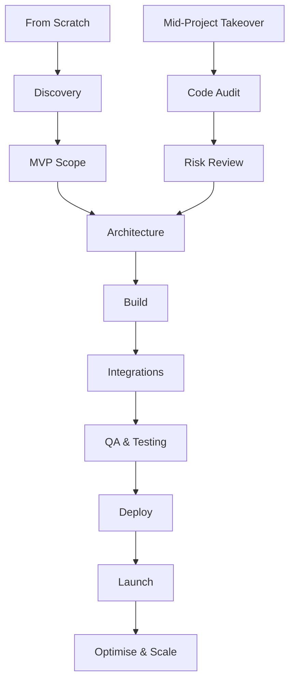

<h1 align="center">Hi, I'm Parth Patel</h1>

<h3 align="center">Senior Full Stack Engineer & Technical Lead</h3>

  
  
  
  
  

---

## About Me

I am a London-based Senior Full Stack Engineer and Technical Lead with 10+ years of commercial experience building SaaS platforms, eCommerce systems, marketplace integrations, and business automation tools.

Currently, I lead Laravel 12 and Vue 3 product development for multi-tenant SaaS, marketplace operations, financial reporting, warehouse workflows, and automation platforms. My work spans architecture, backend APIs, frontend applications, DevOps, testing, cloud infrastructure, code reviews, and mentoring engineering teams.

- Building multi-tenant SaaS platforms with Laravel, Vue, MySQL, queues, APIs, and CI/CD.
- Experienced with Amazon SP-API, eBay API, Linnworks, Google Ads, Amazon Ads, Shopify, WooCommerce, and Magento.
- Strong focus on clean architecture, SOLID principles, testing, performance, security, and maintainability.
- Using automation and AI tools including n8n, OpenAI, Claude, GitHub Copilot, and Codex to improve delivery speed and reduce repetitive work.

---

## Featured Work

| Product | Stack | What I Built |
| --- | --- | --- |
| [Semlis](https://semlis.com) | Laravel 12, Vue 3, Multi-Tenant SaaS | Marketplace seller platform for inventory, orders, ads analytics, P&L reporting, and automation across Amazon, eBay, and Linnworks. |
| [Messeji](https://messeji.co.uk) | Laravel 12, Vue 3, Amazon SP-API, eBay API | Marketplace messaging and ticketing system with real-time notifications, returns, refunds, and order workflows. |
| [Ceckin PMS](https://ceckin.com) | Laravel, RBAC, Geolocation | HR, attendance, rota, KPI, task, and project management platform for internal operations. |
| [PackingWaves](https://pickpackwave.com) | Laravel, Linnworks API | Warehouse pick and pack system with order fulfilment, tote handling, shipping labels, and live workflow processing. |

---

## Tech Stack

### Languages & Frameworks

### Backend, Architecture & APIs

### eCommerce, Marketplace & Advertising

### Data, AI & Automation

### Cloud, DevOps & Infrastructure

### Database, Quality & Engineering Practices

---

## Project Delivery Approach

I can take ownership from a blank idea, an early prototype, or an existing mid-stage project and move it toward a stable, production-ready product. My approach is practical: understand the business goal, audit the technical reality, design the right architecture, deliver in milestones, test properly, deploy safely, and keep improving after launch.

| Stage | What I Focus On |
| --- | --- |
| Discovery | Business goals, user flows, technical risks, integrations, and clear delivery priorities. |
| Architecture | Laravel/Vue structure, database design, API boundaries, queues, permissions, and multi-tenant planning. |
| Delivery | Backend, frontend, marketplace APIs, dashboards, reporting, automation, and clean milestone releases. |
| Stabilisation | Bug fixing, refactoring, performance, security, testing, CI/CD, and production readiness. |
| Launch & Scale | Deployment, monitoring, feedback cycles, optimisation, and long-term maintainability. |

---

## Portfolio Links

### Active SaaS & eCommerce Platforms

- [Semlis](https://semlis.com) - Multi-tenant SaaS for marketplace sellers.
- [Messeji](https://messeji.co.uk) - Marketplace messaging and ticketing platform.
- [Ceckin PMS](https://ceckin.com) - HR, attendance, rota, KPI, and project management system.
- [PackingWaves](https://pickpackwave.com) - Warehouse pick and pack workflow platform.

### Laravel Projects

[Sun Leisure World Tours](https://sunleisureworld.com) |
[Essmeet](https://essmeet.com) |
[My Canvas Story](https://mycanvasstory.com) |
[Learn Hub 360](https://learnhub360.com) |
[Samantc](https://samantc.com) |
[The Pifcoin](https://thepifcoin.com) |
[Fondee](https://fondee.cz)

### Shopify & WordPress Projects

[Dapetz](https://dapetz.com) |
[Skill DIY](https://skilldiy.com) |
[Sidekick Boxing](https://sidekickboxing.co.uk) |
[College Majors 101](https://collegemajors101.com) |
[Peachtree Hotel Group](https://peachtreehotelgroup.com) |
[Energy Storage Day](https://energystorageday.org) |
[Riya Beauty](https://riyabeauty.co.uk) |
[Best Security Group](https://bestsecuritygroup.co.uk)

### CodeIgniter & Core PHP Projects

[Authentic Provence](https://authenticprovence.com) |
[Comics Professionals](https://comicsprofessionals.com) |
[Preferred Printing](https://preferredprinting.net) |
[Joliet U Pull It](https://jolietupullit.com) |
[Catholic Teacher Resources](https://catholicteacherresources.com) |
[Vassar Building Center](https://vbcinc.com) |
[LED Flex Group](https://ledflexgroup.com)

---

## Engineering Metrics

  
  
  
  

  
  

  

  

---

## What I Enjoy Building

- SaaS platforms with complex domain rules, dashboards, reports, and automation.
- Marketplace integrations for Amazon, eBay, Linnworks, Shopify, WooCommerce, and advertising APIs.
- Financial engines for P&L, VAT, marketplace fees, shipping costs, ad spend, and profitability reporting.
- Internal business tools that replace manual workflows with reliable, measurable systems.

  <strong>Open to Senior Full Stack, Technical Lead, SaaS, eCommerce, and marketplace automation opportunities.</strong>

