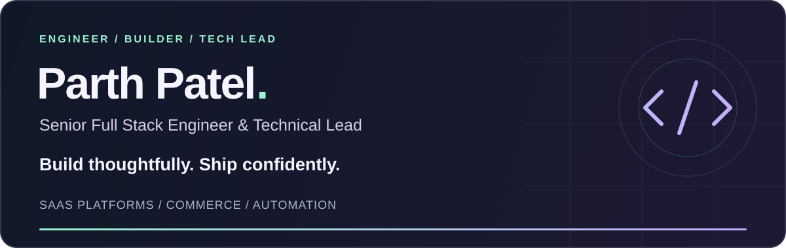

  

  <strong>London, UK · 10+ years of commercial experience · End-to-end product delivery</strong>

  <a href="https://patelparth.co.uk/">Portfolio ↗</a> &nbsp;·&nbsp;
  <a href="https://www.linkedin.com/in/parth-patel-80331313a/">LinkedIn ↗</a> &nbsp;·&nbsp;
  <a href="https://www.upwork.com/freelancers/~013eb51722365c1752">Hire me on Upwork ↗</a> &nbsp;·&nbsp;
  <a href="mailto:webdeveloper.parth@gmail.com">Email me ↗</a>

---

## Thoughtful engineering. Real-world products.

I'm **Parth**, a Senior Full Stack Engineer and Technical Lead building SaaS platforms, eCommerce systems, and automation tools. I turn complex business workflows into software people can actually rely on.

My current focus is **Laravel 12 + Vue 3**: multi-tenant products, marketplace operations, financial reporting, and warehouse workflows. I work across architecture, APIs, frontend, infrastructure, code reviews, and team mentoring.

**What I bring:** product ownership, clean architecture, practical automation, and a focus on maintainability beyond launch.

## Selected work

### 01 / Semlis
**Marketplace operations, connected.**

Multi-tenant seller platform bringing together inventory, orders, advertising analytics, P&L reporting, and automation across Amazon, eBay, and Linnworks.

`Laravel 12` `Vue 3` `Multi-tenant SaaS`

[Explore Semlis ↗](https://semlis.com)

### 02 / Messeji
**One place for marketplace conversations.**

Messaging and ticketing platform with real-time notifications, returns, refunds, and order workflows.

`Laravel 12` `Vue 3` `Amazon SP-API` `eBay API`

[Explore Messeji ↗](https://messeji.co.uk)

### 03 / Ceckin PMS
**Everyday team operations, simplified.**

HR, attendance, rota, KPI, task, and project management for internal operations, with role-based access and geolocation.

`Laravel` `RBAC` `Geolocation`

[Explore Ceckin ↗](https://ceckin.com)

### 04 / PackingWaves
**From order to dispatch.**

Warehouse pick and pack workflows covering fulfilment, tote handling, shipping labels, and live workflow processing.

`Laravel` `Linnworks API`

[Explore PackingWaves ↗](https://pickpackwave.com)

## My everyday toolkit

  
  
  
  
  
  
  
  
  
  
  
  

| Area | Technologies & focus |
| :--- | :--- |
| **Product development** | PHP · Laravel · Vue 3 · TypeScript · JavaScript · Livewire · Inertia.js · Tailwind CSS · PrimeVue |
| **Backend & data** | MySQL · Redis · REST APIs · Queues · Webhooks · OAuth / SSO · Payment gateways · Multi-tenant & event-driven architecture |
| **Commerce & integrations** | Amazon SP-API · eBay · Linnworks · Shopify · WooCommerce · Magento · Google Ads · Amazon Ads · Facebook API |
| **AI & automation** | n8n · OpenAI · Claude · GitHub Copilot · Codex · Workflow automation |
| **Cloud & delivery** | AWS EC2 / S3 · Linux · Nginx · Apache · Cloudflare · GitHub Actions · CI/CD · Git |
| **Engineering quality** | PHPUnit · Pest · TDD · SOLID · Query optimisation · Security · Code reviews · Mentoring |

<strong>More experience & specialist work</strong>

- **Web foundations:** HTML, CSS, jQuery, Core PHP, CodeIgniter, and WordPress.
- **Financial workflows:** P&L engines, VAT, marketplace fees, shipping costs, ad spend, profitability reporting, and BI dashboards.
- **Architecture & operations:** multi-tenant database design, design patterns, SSL / DNS, security hardening, and production deployments.
- **AI-assisted delivery:** prompt engineering and developer tools to reduce repetitive work.

## From idea to production

Starting fresh or taking over an existing product, I work in clear milestones with testing and maintainability built into delivery.

| Step | What you can expect |
| :--- | :--- |
| **01 · Understand** | Business goals, user flows, integration requirements, and a code audit for existing products. |
| **02 · Design** | A focused scope, architecture, data model, API boundaries, and clear delivery priorities. |
| **03 · Build** | Backend, frontend, integrations, and automation delivered in practical milestones. |
| **04 · Ship** | Testing, performance checks, security, CI/CD, and production deployment. |
| **05 · Improve** | Monitoring, feedback, optimisation, and ongoing product care. |

## More from my portfolio

<strong>Explore Laravel, Shopify, WordPress & PHP projects</strong>

### Laravel Projects

[Sun Leisure World Tours](https://sunleisureworld.com) |
[Essmeet](https://essmeet.com) |
[My Canvas Story](https://mycanvasstory.com) |
[Learn Hub 360](https://learnhub360.com) |
[Samantc](https://samantc.com) |
[The Pifcoin](https://thepifcoin.com) |
[Fondee](https://fondee.cz)

### Shopify & WordPress Projects

[Dapetz](https://dapetz.com) |
[Skill DIY](https://skilldiy.com) |
[Sidekick Boxing](https://sidekickboxing.co.uk) |
[College Majors 101](https://collegemajors101.com) |
[Peachtree Hotel Group](https://peachtreehotelgroup.com) |
[Energy Storage Day](https://energystorageday.org) |
[Riya Beauty](https://riyabeauty.co.uk) |
[Best Security Group](https://bestsecuritygroup.co.uk)

### CodeIgniter & Core PHP Projects

[Authentic Provence](https://authenticprovence.com) |
[Comics Professionals](https://comicsprofessionals.com) |
[Preferred Printing](https://preferredprinting.net) |
[Joliet U Pull It](https://jolietupullit.com) |
[Catholic Teacher Resources](https://catholicteacherresources.com) |
[Vassar Building Center](https://vbcinc.com) |
[LED Flex Group](https://ledflexgroup.com)

---

## Let's build something useful.

Open to **Senior Full Stack Engineer**, **Technical Lead**, and **SaaS, eCommerce & marketplace automation** opportunities.

Have a product to launch, a workflow to automate, or an existing platform to improve? Let's talk.

**[Start a conversation ↗](mailto:webdeveloper.parth@gmail.com)** · [Work with me on Upwork](https://www.upwork.com/freelancers/~013eb51722365c1752) · [View my portfolio](https://patelparth.co.uk/)

[Browse my repositories & GitHub activity ↗](https://github.com/parth11991?tab=repositories)
